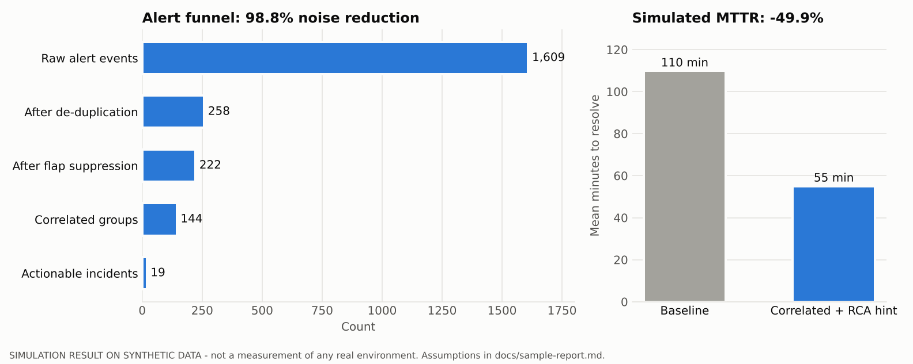
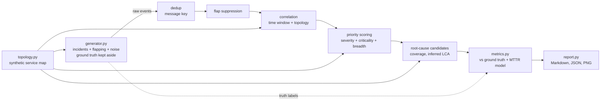

# AIOps Event Correlation Simulator

> **Disclaimer:** Representative portfolio project built with synthetic data. Not derived from any employer or client code.
> **Every metric in this repository is a simulation result on synthetic data.** None of it measures any real environment.

A Python simulator that produces a realistic **alert storm** from a synthetic bank's monitoring tools (node, interface and application alerts, in the style of a network/server monitor) and runs it through an AIOps-style event pipeline:

**de-duplication -> flap suppression -> time + topology correlation -> priority scoring -> root-cause candidates**

It then scores the pipeline against ground truth (noise reduction, grouping purity, root-cause accuracy) and estimates the effect on MTTR with a simple, openly stated model.



## Business use case

When a shared component such as an access switch or a load balancer fails, monitoring tools raise one alert per affected device and metric, and repeat it on every poll. Operations teams get hundreds of alerts for a single fault, spend the first part of the outage working out which one matters, and often open several incidents for the same problem. For a bank, that triage delay adds directly to customer-facing downtime on services like card authorisation or payments.

Event management and AIOps tooling exists to compress that storm into one prioritised, actionable incident with a probable root cause. This project shows the mechanics and a way to **measure** whether a configuration helps, before tuning anything on a live platform.

## What it demonstrates

| Stage | How it works | Comparable platform concept |
|---|---|---|
| Synthetic topology | 43 nodes: 2 core switches, firewall, 2 load balancers, 6 access switches, 8 services (2 app servers + 1 database server + an application node each). Services carry business criticality 1 to 3. | CMDB / service map, CSDM application services |
| Alert generator | 12 incidents, each a root fault followed by delayed downstream symptoms that repeat every poll, plus flapping interfaces and isolated low-severity noise. 20% of incident roots are silent (unmonitored) on purpose. Ground-truth labels are kept for scoring only. | SolarWinds-style node / interface / application alerts |
| De-duplication | Message key = (node, entity, metric). Repeats increment a counter; a reset closes the alert. | Event rules / message key |
| Flap suppression | 3 or more re-opens of a key with at most 15 minutes between them are collapsed into one flapping alert, which never opens an incident. | Flap detection (frequency / interval) |
| Correlation | An alert joins a recent group (5-minute gap, 60-minute maximum span) only if it is topologically related to a node already in the group: it depends on that node, the node depends on it, or they share a non-core upstream dependency within 3 hops. When several groups qualify, the alert joins the one holding its most severe upstream alert. | Alert grouping by time + CMDB relationships |
| Priority scoring | 60 points for severity, 25 for the highest criticality among impacted services, 15 for breadth, giving P1 to P4. A group becomes an *actionable incident* at 50 points or more. | Alert priority / impact |
| Root-cause candidates | Alerting nodes are ranked by the share of the group that sits downstream of them, then by closeness to the network core, then by earliest alert. If no alerting node explains at least 75% of the group, the lowest common upstream node is offered as an *inferred* candidate. | Probable root cause |
| Evaluation | Funnel counts, noise reduction %, fragmentation, purity, RCA top-1 and top-3 accuracy, false positives, simulated MTTR. | Value reporting |

## Architecture



## Tech stack

Python 3.10+ · matplotlib (chart only) · pytest · ruff · Docker · GitHub Actions

## Setup

```bash
git clone https://github.com/abdulraheemm064/aiops-event-correlation-sim.git
cd aiops-event-correlation-sim
python -m venv .venv && source .venv/bin/activate
pip install -r requirements-dev.txt
```

## Usage

```bash
# Reference run (writes docs/sample-report.md, docs/sample-report.json, docs/noise-reduction.png)
python -m aiops_sim run --out-dir docs

# Explore: other seeds, longer horizons, wider correlation window, export the raw alert stream
python -m aiops_sim run --seed 11 --hours 48 --incidents 20 --window 600 \
    --out-dir reports --alerts-csv reports/alerts.csv

# Docker
docker build -t aiops-sim .
docker run --rm -v "$PWD/reports:/app/reports" aiops-sim run --out-dir reports
```

## Sample output (seed 7, 24 h) - simulation on synthetic data

```
raw events 1609 -> dedup 258 -> groups 144 -> actionable 19 (98.8% noise reduction)
RCA top-1 75.0% | simulated MTTR 109.8 -> 55.0 min (-49.9%)
```

| Metric | Value |
|---|---|
| Injected incidents detected | 12 / 12 |
| Mean groups per incident | 1.0 |
| Group purity | 97.4% |
| Root cause correct, top-1 / top-3 | 75.0% / 83.3% |
| Actionable groups that were really noise | 7 |

Full report: [`docs/sample-report.md`](docs/sample-report.md). The misses are left in on purpose. When a database server is unmonitored and only its application alerts, no topology method can name the database with confidence. Showing where the approach fails is more useful than a perfect score on toy data.

### About the MTTR number

It comes from a model, not a measurement:

- **Baseline:** 2 minutes per raw alert of triage (capped at 45), plus 40 minutes of diagnosis, plus fix time.
- **With correlation:** 5 minutes of triage, plus 10 minutes of diagnosis when the top root-cause candidate is right (40 when it's wrong), plus the same fix time.

Change `MttrAssumptions` and the result changes with it. A test checks that equal assumptions give zero improvement.

## Tests

```bash
pytest       # 26 tests
ruff check .
```

The tests cover topology traversal and relation rules; de-duplication, reopening and orphan resets; flap detection thresholds; correlation needing both time and topology; cause-aware group selection; priority scoring; root-cause ranking including the inferred silent upstream; determinism; funnel monotonicity; the MTTR model's sensitivity to its assumptions; zero false positives without noise; and CLI outputs (Markdown, JSON, PNG, CSV).

## Security considerations

- Fully offline and synthetic. There are no credentials, network calls or real hostnames. Node names use an invented `cbk-` / `cb-` scheme.
- If you adapt it to replay real alert exports, treat them as sensitive: they reveal network topology and naming conventions. Keep them out of the repository (`.gitignore` excludes `data/private/` and `reports/`).
- The Docker image runs as a non-root user.

## Limitations and future enhancements

- Correlation runs in a single pass over a time-ordered batch. A streaming engine would also need to merge groups, split them, and handle late events.
- Flap detection is evaluated after the fact on complete chains. Live systems decide incrementally.
- The topology is static and complete. Real CMDBs have gaps, and those gaps are exactly where topology-based correlation fails. A "missing relationship" fault mode would be a good addition.
- The scoring weights are hand-tuned. A natural next step is a grid search over window, hop and threshold settings, optimising purity against fragmentation.
- Ideas for later: export grouped incidents in the JSON shape of a ServiceNow Event Management `em_event` payload; add change-correlation ("a change was implemented on this CI 10 minutes earlier"); add a small Streamlit dashboard.

## Licence

MIT. See [LICENSE](LICENSE).

---

Representative portfolio project built with synthetic data. Not derived from any employer or client code. All metrics are simulation results on synthetic data. Product names are mentioned only to describe the concepts modelled; this project is not affiliated with or endorsed by any vendor.
